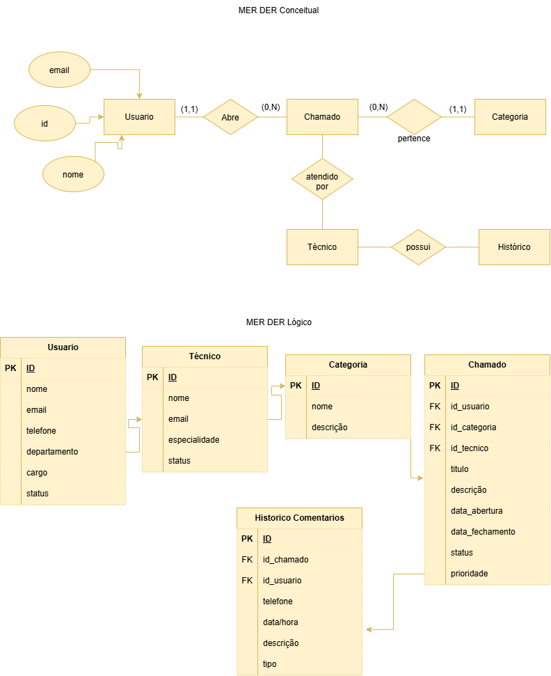

# Atendimento a Chamados

---

## MER Conceitual e Lógico



---

# Dicionário de Dados

| Entidade | Atributo | Tipo | Tamanho | Descrição |
|-----------|-----------|--------|----------|-------------|
| Usuario | id | INT | 11 | Chave Primária |
| Usuario | nome | VARCHAR | 100 | Nome do usuário |
| Usuario | email | VARCHAR | 100 | E-mail |
| Usuario | telefone | VARCHAR | 20 | Telefone |
| Usuario | departamento | VARCHAR | 50 | Departamento |
| Usuario | cargo | VARCHAR | 50 | Cargo |
| Usuario | status | VARCHAR | 20 | Status |
| Tecnico | id | INT | 11 | Chave Primária |
| Tecnico | nome | VARCHAR | 100 | Nome do técnico |
| Tecnico | email | VARCHAR | 100 | E-mail |
| Tecnico | especialidade | VARCHAR | 100 | Especialidade |
| Tecnico | status | VARCHAR | 20 | Status |
| Categoria | id | INT | 11 | Chave Primária |
| Categoria | nome | VARCHAR | 50 | Nome da categoria |
| Categoria | descricao | VARCHAR | 255 | Descrição |
| Chamado | id | INT | 11 | Chave Primária |
| Chamado | titulo | VARCHAR | 100 | Título |
| Chamado | descricao | VARCHAR | 255 | Descrição |
| Chamado | data_abertura | DATE | - | Data de abertura |
| Chamado | data_fechamento | DATE | - | Data de fechamento |
| Chamado | status | VARCHAR | 20 | Status |
| Chamado | prioridade | VARCHAR | 20 | Prioridade |
| Chamado | id_usuario | INT | 11 | FK Usuario |
| Chamado | id_categoria | INT | 11 | FK Categoria |
| Chamado | id_tecnico | INT | 11 | FK Tecnico |
| Historico_Comentarios | id | INT | 11 | Chave Primária |
| Historico_Comentarios | id_chamado | INT | 11 | FK Chamado |
| Historico_Comentarios | id_usuario | INT | 11 | FK Usuario |
| Historico_Comentarios | data_hora | DATETIME | - | Data e hora |
| Historico_Comentarios | descricao | VARCHAR | 255 | Comentário |
| Historico_Comentarios | tipo | VARCHAR | 30 | Tipo da ação |

---

# Dados de Teste

Os dados de teste estão disponíveis nos arquivos CSV abaixo:

- [usuario.csv](usuario.csv)
- [tecnico.csv](tecnico.csv)
- [categoria.csv](categoria.csv)
- [chamado.csv](chamado.csv)
- [historico_comentarios.csv](historico_comentarios.csv)

---

# DDL

```sql
CREATE DATABASE atendimento_chamados;
USE atendimento_chamados;

CREATE TABLE usuario (
    id INT AUTO_INCREMENT PRIMARY KEY,
    nome VARCHAR(100),
    email VARCHAR(100),
    telefone VARCHAR(20),
    departamento VARCHAR(50),
    cargo VARCHAR(50),
    status VARCHAR(20)
);

CREATE TABLE tecnico (
    id INT AUTO_INCREMENT PRIMARY KEY,
    nome VARCHAR(100),
    email VARCHAR(100),
    especialidade VARCHAR(100),
    status VARCHAR(20)
);

CREATE TABLE categoria (
    id INT AUTO_INCREMENT PRIMARY KEY,
    nome VARCHAR(50),
    descricao VARCHAR(255)
);

CREATE TABLE chamado (
    id INT AUTO_INCREMENT PRIMARY KEY,
    titulo VARCHAR(100),
    descricao VARCHAR(255),
    data_abertura DATE,
    data_fechamento DATE,
    status VARCHAR(20),
    prioridade VARCHAR(20),
    id_usuario INT,
    id_categoria INT,
    id_tecnico INT,
    FOREIGN KEY (id_usuario) REFERENCES usuario(id),
    FOREIGN KEY (id_categoria) REFERENCES categoria(id),
    FOREIGN KEY (id_tecnico) REFERENCES tecnico(id)
);

CREATE TABLE historico_comentarios (
    id INT AUTO_INCREMENT PRIMARY KEY,
    id_chamado INT,
    id_usuario INT,
    data_hora DATETIME,
    descricao VARCHAR(255),
    tipo VARCHAR(30),
    FOREIGN KEY (id_chamado) REFERENCES chamado(id),
    FOREIGN KEY (id_usuario) REFERENCES usuario(id)
);
